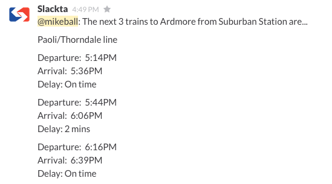

# slackta.js

A basic next-to-arrive Slack integration for SEPTA's regional rail lines.

slackta.js uses [mashape.com](https://www.mashape.com)'s SEPTA API.

## Usage

Assuming your `slackta.js` instance is deployed and integrated with your Slack:

```
/septa Destination
```

Example:

```
/septa Ardmore
```



## Deploying & configuring your integration

1. `heroku create`
2. `heroku config:set INCOMING_SLACK_WEB_HOOK_PATH=<The path to your Slack webhook (available via your Slack admin)>`
3. `heroku config:set MASHAPE_KEY=<The path to your Mashape key (get one of these from mashape.com>`
4. `git push heroku master`
3. Create a Slack command integration via your Slack admin; configure it to post to `<https://your-slackta.herokuapp.com/integration>`

## Running locally

```
npm install
node app
```

Run tests:

```
npm test
```
